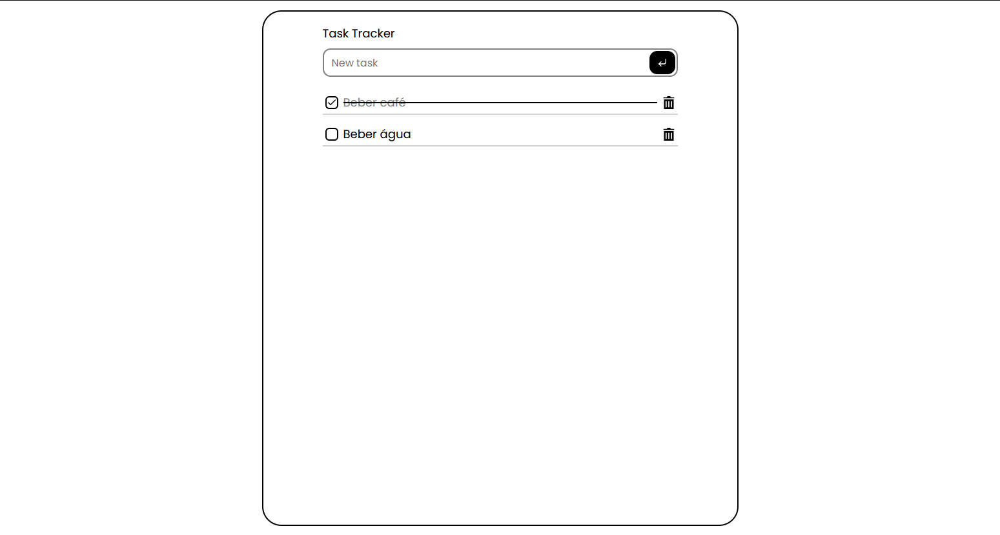

# Task Tracker



## Descrição

Projeto desenvolvido como parte de um desafio proposto pelo site [roadmap.sh](https://roadmap.sh) para praticar habilidades com HTML, CSS e JavaScript puro.

[Link do Site](https://lheerme.github.io/task-tracker/)


## Funcionalidades

- ✅ Adicionar nova tarefa
- 🗑️ Remover tarefa
- ✔️ Marcar tarefa como concluída
- 💾 Persistência de dados com `localStorage`

## Como Executar

1. Clone este repositório em sua máquina local.
2. Instale as dependências usando o comando:
   ```
   npm install
   ```
3. Inicie o aplicativo com:
   ```
   npm run dev
   ```
4. Abra o aplicativo no seu navegador.